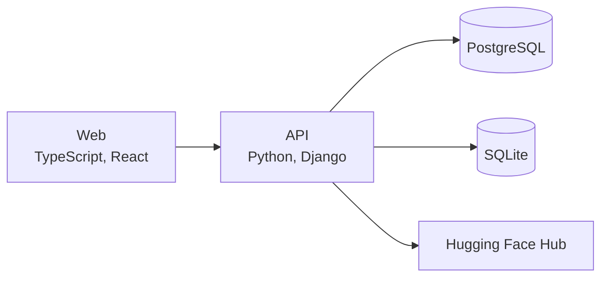

# Colorgrader

Colorgrader is a grading aid that color-highlights the part of each student's free-response answer that addresses each of the teacher's questions and finds answers that say similar things. Teachers upload an assignment as JSON, a Django API runs a Hugging Face question-answering model and sentence embeddings over every answer, and a React frontend shows the highlighted spans and similar answers.

